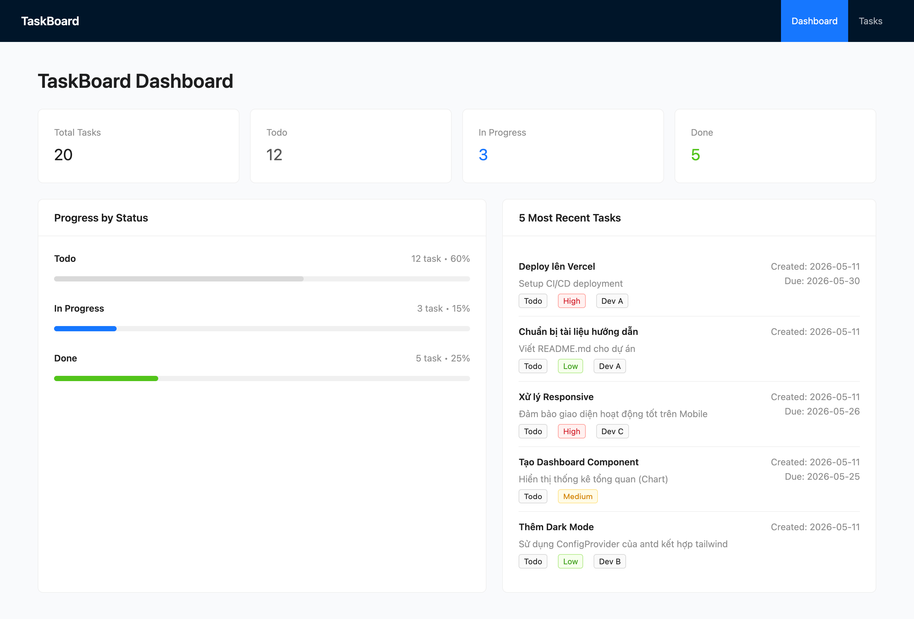
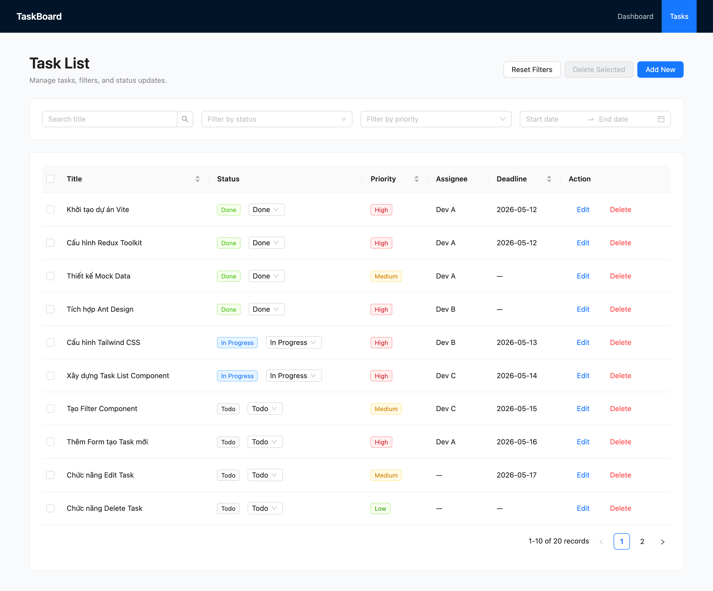
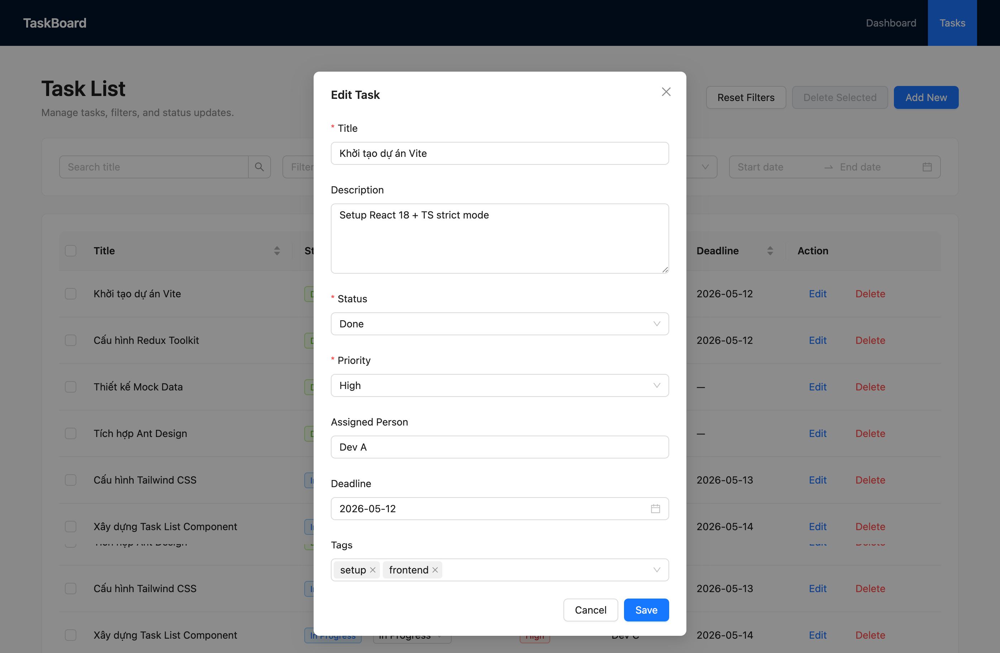

# TaskBoard

Ứng dụng quản lý công việc được xây dựng bằng React + TypeScript + Vite, sử dụng Redux Toolkit để quản lý state và Ant Design để xây dựng giao diện.

## Cài đặt và chạy dự án

### 1. Cài đặt dependencies

```bash
npm install
```

### 2. Chạy môi trường development

```bash
npm run dev
```

### 3. Build production

```bash
npm run build
```

### 4. Kiểm tra lint

```bash
npm run lint
```

### 5. Preview bản build

```bash
npm run preview
```

## Tính năng đã làm

### 1. Dashboard

- Hiển thị tổng số task
- Hiển thị số lượng task theo từng trạng thái: Todo, In Progress, Done
- Hiển thị progress theo trạng thái
- Hiển thị 5 task được tạo gần nhất

### 2. Quản lý danh sách task

- Hiển thị danh sách task bằng Ant Design Table
- Phân trang danh sách task
- Sắp xếp theo:
  - Title
  - Priority
  - Deadline
- Cập nhật nhanh trạng thái task ngay trên bảng

### 3. Bộ lọc và tìm kiếm

- Tìm kiếm theo title bằng `Input.Search`
- Debounce 300ms khi tìm kiếm
- Lọc theo nhiều trạng thái cùng lúc
- Lọc theo priority
- Lọc theo khoảng deadline bằng `DatePicker.RangePicker`
- Reset toàn bộ bộ lọc
- Logic filter được xử lý qua Redux selector

### 4. CRUD task

- Tạo task mới
- Chỉnh sửa task
- Xóa từng task với hộp thoại xác nhận
- Xóa nhiều task cùng lúc

### 5. Form và trải nghiệm giao diện

- Sử dụng Ant Design Form để validate dữ liệu đầu vào
- Giao diện kết hợp Ant Design và Tailwind CSS
- Có điều hướng giữa Dashboard và Task List
- Có hỗ trợ responsive layout cơ bản

## Công nghệ sử dụng

- React 19
- TypeScript
- Vite
- Redux Toolkit
- React Router
- Ant Design
- Tailwind CSS

## Demo

### Dashboard



### Task List



### Task Modal



